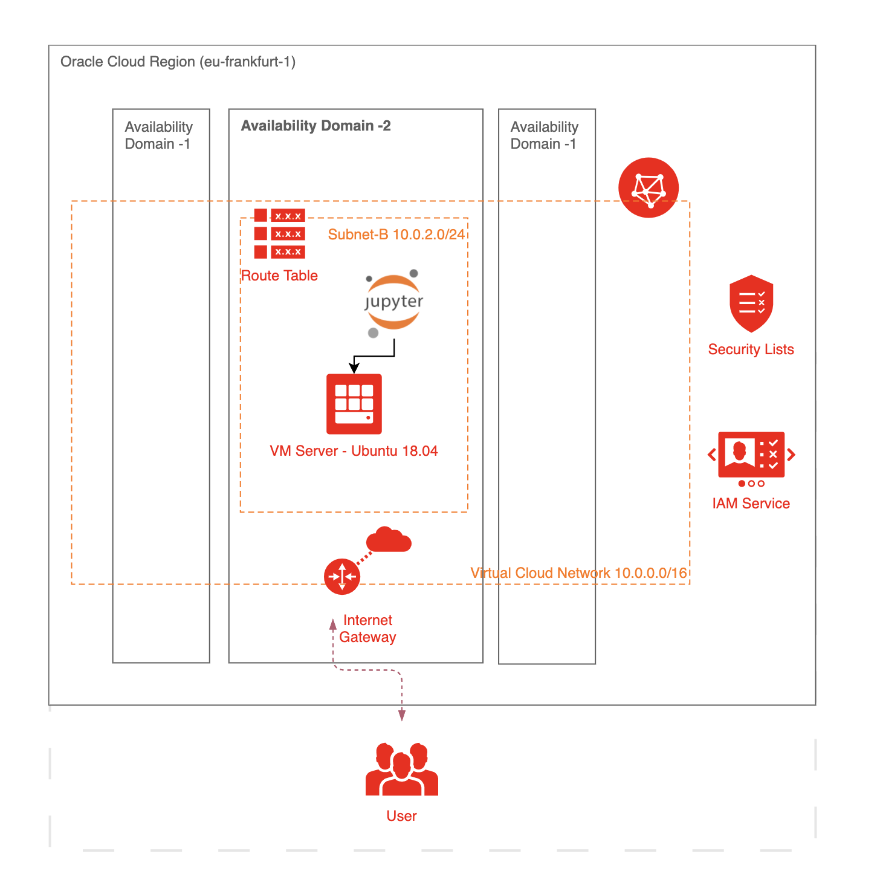
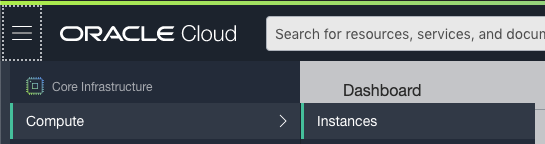
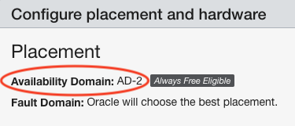

# OCI Free Tier Jupyter-lab
This is a Terraform configuration that deploys a **jupyter lab environemnt** on **Oracle Cloud Infrastructure (OCI)** and is designed to run using only the **Always Free resources**. 

The repository contains the install script code as well as the Terraform code to create all the required cloud resources and configures the application on the created resources. The steps below guide you through deploying the application on your tenancy

---
## Cloud Architecture
<p align="center">
  
</p>
--- 
## Pre-requisites

**Oracle Always Free Account**
create [Always Free](https://www.oracle.com/cloud/free/) Oracle Cloud Infrastructure (OCI) account

**Terraform**
Download and install for your OS [Terraform](https://www.terraform.io/downloads.html).

**OCI API Keys**
Follow the documentation for [generating private/public keys OCI Documentation](https://docs.cloud.oracle.com/iaas/Content/API/Concepts/apisigningkey.htm#two).


---

## Setup

1. [Login](https://console.us-ashburn-1.oraclecloud.com/) to Oracle Cloud Infrastructure Console by providing the tenancy name and user credentials

2. upload public key to OCI user
    - how to generate keys refer to Pre-requisites section
    - go to the desired user that will provision the infrastructure 
    - `Identity > Users > User Details > API Keys > Add Public Key`
    - with drag and drop upload public key

3. configure environment variables for OCI connection
  - copy the following lines into [env-vars_tenancy](env-vars_tenancy) based on your OS and replace the values 
    ```console
    # unix
    export TF_VAR_tenancy_ocid=<value>
    export TF_VAR_user_ocid=<value>
    export TF_VAR_fingerprint=<value>
    export TF_VAR_private_key_path=<value>
    export TF_VAR_region=<value>
    export TF_VAR_compartment_ocid=<value>
    ```
    ```console
    # Windows
    setx TF_VAR_tenancy_ocid <value>
    setx TF_VAR_user_ocid <value>
    setx TF_VAR_fingerprint <value>
    setx TF_VAR_private_key_path <value>
    setx TF_VAR_region <value>
    setx TF_VAR_compartment_ocid <value>
    ```

  - copy & paste identification environment variables from OCI into the [env-vars_tenancy](env-vars_tenancy) file ([source](https://registry.terraform.io/providers/hashicorp/oci/latest/docs)).

    - **TF_VAR_tenancy_ocid** Enter the tenancy OCID. You can find the tenancy OCID in the menu under `Administration > Tenancy Details`. It is a string similar to: ocid1.tenancy.oc1..aaaaa..
    - **TF_VAR_user_ocid** Enter the user OCID. In the Oracle Cloud Infrastructure Console, click `Identity > Users`. The list of users is displayed, along with the user OCID. Click Copy below the user name to copy the required user OCID. 
    - **TF_VAR_fingerprint** Enter the API signing key fingerprint. In the Oracle Cloud Infrastructure Console, on the Users page, click the user to view the user details page `Identity > Users > User Details > API Keys`. Copy the API key fingerprint from the key listed in the API Keys section. 
    - **TF_VAR_private_key_path** Enter the complete path and file name of the API private key on your local system.
    - **TF_VAR_region** In the region section of the env-vars file, enter the region where you want to create the infrastructure components. To get the Region Identifier go to `Administration > Region Management` and copy the subscribed region identifier (such as eu-frankfurt-1)
    - **TF_VAR_compartment_ocid** In the compartment section of the env-vars file, enter the compartment OCID of the compartment where you want to create the infrastructure components. If you primarily work in a single compartment, consider exporting the compartment OCID as well. The tenancy OCID is also the OCID of the root compartment, and can be used where any compartment id is required.  
    `Identity > Compartments > Compartment Details` 

4. (optional) replace "tenancy" in filename [env-vars_tenancy](env-vars_tenancy) with your tenancy name for best practice (in case of multiple tenancies)

5. Activate the environment variables specified in [env-vars_tenancy](env-vars_tenancy) for the current session. These variables will be used in [variables.tf](variables.tf) for authentication.
    ```console  
    # unix
    cd path/to/env-vars_tenancy            
    chmod +x env-vars_tenancy
    source env-vars_tenancy  
    ```
    ```console
    # Windows PowerShell
    cd /path/to/env-vars_tenancy
    env-vars_tenancy
    ```

6. Find the always free Availability Domain (AD) in OCI
 
|  |  |  |
|---|---|---|

  - In the file [variables.tf](variables.tf) replace the default value `x` for the variable `AD` with 1, 2 or 3 like: 

    ```python
    variable "AD" {
      default = "2"
    }
    ```
  
---

## Terraform

1. Verify Your Terraform Configuration
- launch Windows PowerShell/Terminal and navigate to the folder where your Terraform modules are located. Run terraform init to init the terraform providers
  ```console
  cd path/to/oci_freetier_jupyter_lab
  terraform init
  ```
- you should see a message like `Terraform has been successfully initialized!`

2. Plan & Build Cloud Infrastructure with Terraform
- Run terraform plan to create an execution plan
  ```console
  terraform plan
  ```

- Run terraform apply to create the resources on OCI
  ```console
  terraform apply
  ```
- Do you want to perform these actions? Enter a value: `yes`

3. Output  
- The final output should look as follows:
  ```python
  # connect to the compute instance
  ssh -i keys/key_private.pem ubuntu@<public_ip>

  # port forward connect to the compute instance
  ssh -i keys/key_private.pem -L <remote_port>:localhost:<local_port> ubuntu@<public_ip>
  ```

4. Start Jupyter lab
  ```python
  # Connect to the instance using the last ssh output
  ssh -i keys/key_private.pem -L <remote_port>:localhost:<local_port> ubuntu@<public_ip>

  # start a jupyter lab
  jupyter lab
  ```

open: [http://localhost:\<port>/](http://localhost:8882/) in your browser


--- 

### common errors
`'This is likely because the Always Free eligible (Micro) shapes are not available in the region where the stack was applied. Try switching to the Home Region for your tenancy.'`
*Solution* -> make sure to select the right AD


`Error: Service error:InternalError. Out of host capacity.. http status code: 500. Opc request , The service for this resource encountered an error. Please contact support for help with that service`
*Solution* -> Oracle run out of physical machines -> try later -> make sure you have less than two instances running on your tenanacy